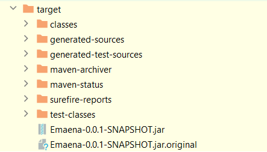
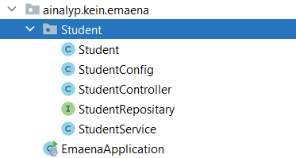

# Emaena
super ultra mega simple CRUD
Simple CRUD JAVA Spring BOOT by Beigut Beisenkhan

request examples:

**For Post Request**

POST http://localhost:8080/api/v1/student
Content-Type: application/json

{
"name":"Beibit",
"email":"beisenkhan112@gmail.com",
"dob":"2010-01-25"
}

**To Read Request**

GET http://localhost:8080/api/v1/student

**To Delete Request**

DELETE http://localhost:8080/api/v1/student/1

**To Update Request**

PUT http://localhost:8080/api/v1/student/1?name=Arman
Content-Type: application/json

PUT http://localhost:8080/api/v1/student/2?email=algakazakhstan@gmail.com
Content-Type: application/json

**JAR IS HERE**

**USED CLASSES**

